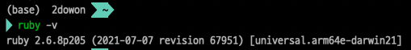
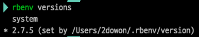
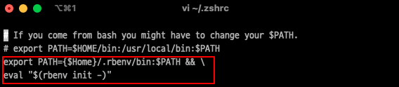
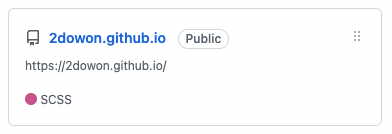
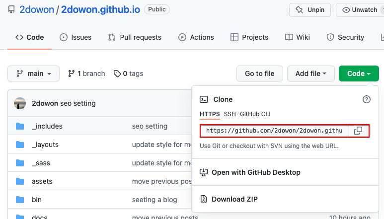
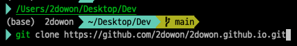
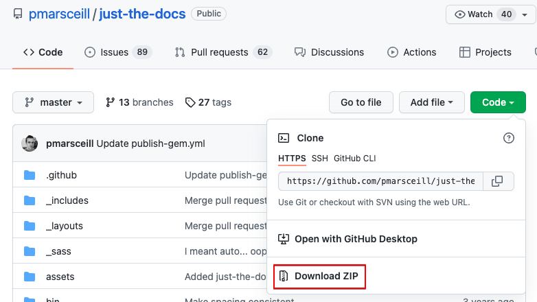
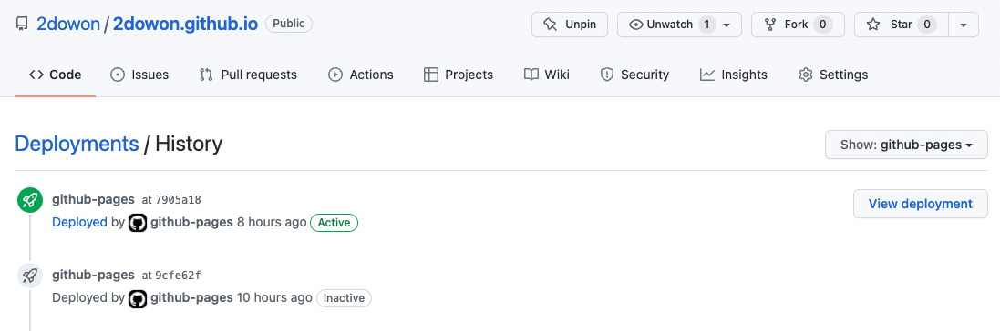
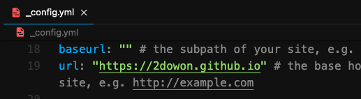

> 참고로 현재 보고 있는 블로그는 [Gatsby](https://www.gatsbyjs.com/)로 만들었습니다. Jekyll로 만든 블로그가 생각보다 불편해서 결국 처음에 썼었던 Gatby로 넘어왔습니다 ㅎㅎ 그래도 Jekyll로 블로그 만들었을 당시 삽질도 많이 했고, 누군가는 또 Jekyll 블로그를 만들고 싶어할 수도 있으니까 포스팅은 그대로 남겨둡니다!

예전에 Gatsby로 GitHub 블로그를 만든 적이 있었는데, 이번에는 Jekyll로 만들어보려고 한다. Gatsby로 만드는게 궁금하다면 예전에 내가 작성한 [이 글](https://dwon-lee.tistory.com/6?category=931682)을 참고!하고, 본론으로 넘어가보자!

## Jekyll 블로그를 위한 환경 설정

Jekyll로 GitHub 블로그 만들기 위해서는 가장 먼저 Jekyll을 설치해야 한다. 참고로 나는 **M1 MacOS** 환경에서 진행하고 있다.

Jekyll을 설치하기 위해서는 먼저 루비가 설치되어 있어야 한다. 사실 Mac OS면 기본적으로 루비가 설치되어 있긴한데, 기본으로 설치되어있는 Ruby는 구버전이라서 다시 설치해야되는 것으로 알고 있다.

나도 처음에는 `ruby -v` 를 확인했을 때 아래처럼 나와서 루비가 제대로 설치되어 있는줄 알았다. 아래처럼 arm어쩌구 하면 루비가 제대로 설치된 상태가 아니다. ⚠️



### m1을 위한 사전 세팅

> gcc 설치

- 기본적으로 깔려있지만, 해당 작업을 생략하면 디펜던시 에러가 발생한다고 한다.

```bash
brew install gcc
```

### Ruby 설치

```bash
brew install rbenv ruby-build
```

- rbenv 설치

```bash
  rbenv versions
```

- 설치 가능한 ruby 버전 확인

```bash
  rbenv install -l    // 설치 가능한 버전보기
  rbenv install -list-all     // 설치 가능한 모든 버전 보기
```

- 원하는 버전의 ruby 설치 (나는 LTS 버전 중 하나인 2.7.5를 설치했다.)

```bash
  rbenv install 원하는 버전
```

```bash
rbenv global 방금 설치한 버전
```

- ruby 버전 확인



```bash
  rbenv versions
```

위 이미지처럼 설치한 버전이 나온다면 제대로 설치가 끝났다.

## 터미널 설정

- zsh를 사용하고 있기 때문에, zsh 설정 파일을 열어준다

```bash
  vi ~/.zshrc
```

- 아래처럼 PATH를 추가해준다

```bash
  export PATH={$Home}/.rbenv/bin:$PATH && \
  eval "$(rbenv init -)"
```



> 설정 파일 수정을 위한 간단한 vi 명령어

- `i` : 입력모드로 수정
- `wq` : 저장 후 종료
- `source ~/.zshrc` : 환경설정 바꾼 것을 적용한다

### Jekyll 블로그 구동을 위한 설정

- Jekyll 블로그를 위한 설치
  ```bash
  gem install bundler
  ```
  ```bash
  rbenv rehash
  ```
  ```json
  bundle install
  ```
- Jekyll 블로그 실행 ⇒ `http://localhost:4000/` 에서 확인 가능하다
  ```json
  bundle exec jekyll serve
  ```

## GitHub Repository 만들기

Jekyll를 이용해 GitHub 블로그를 만들 것이므로 당연히 GitHub Repository가 있어야 한다.

> 아래 이름으로 된 GitHub Repository를 만들어야한다. 그리고 이 이름이 곧 블로그 url이 된다.

```bash
계정명.github.io
```



#### GitHub Repository Clone

이제 로컬(본인 컴퓨터)의 원하는 위치에 해당 GitHub Repository를 클론해둬야 한다.

```bash
git clone 본인 레포 URL
```



레포를 만들고나면 위 이미지처럼 HTTPS 주소로 된 url을 하나 찾을 수 있다. git clone 명령어 뒤에 해당 주소를 넣어서 실행하게 되면 해당 레포를 클론해올 수 있다. 반드시 꼭 레포를 생성하고자 하는 위치로 이동 후에 클론하자!

> 예를 들자면, 나는 Dev라는 폴더 아래에 내 레포를 클론해올 예정이다.



## Jekyll 테마 적용

이제 원하는 Jekyll 테마를 찾아서 적용해줄 일만 남았다. 구글에 Jekyll 테마를 검색하면 다양한 테마들을 볼 수 있는데, 나는 그 중 [just the docs](https://pmarsceill.github.io/just-the-docs/)라는 테마를 사용하기로 했다.

#### 원하는 테마 코드 다운로드



원하는 테마를 찾았으면 해당 GitHub 레포로 가서 코드를 다운로드 받을 수 있다. 해당 레포를 처음부터 fork하거나 clone할 수도 있는데, 그렇게 하면 해당 테마의 커밋 내역까지 다 가져오게 되기 때문에 개인적으로는 다운로드해서 테마를 적용하는 것을 선호한다.

다운로드 받은 코드의 모든 파일을 복사해서 아까 내 레포를 클론한 폴더 안에 다 넣어주면 된다!

#### 테마 적용하기

- 적용한 테마를 설치
  ```bash
  bundle install
  ```
- jekyll 블로그 서버 실행하기
  ```json
  bundle exec jekyll serve
  ```

## 배포

지금까지 작업한 내역들을 커밋해서 푸시하게 되면 사실 배포는 알아서 된다.

```bash
git add . && git commit -m "커밋 메시지 적기" && git push
```



### 만약 jekyll 블로그의 css가 깨진다면 🤔

처음 블로그를 만들고 배포한 후에 css가 깨져서 당황했었는데, 이 경우에는 `_config.yml` 파일의 url이나 baseurl을 내 github과 연결된 주소로 변경해주면 된다.



## Ref.

- [깃허브 블로그 만들기(지킬, Jekyll)](http://blog.illunex.com/%EA%B9%83%ED%97%88%EB%B8%8C-%EB%B8%94%EB%A1%9C%EA%B7%B8-%EB%A7%8C%EB%93%A4%EA%B8%B0%EC%A7%80%ED%82%AC-jekyll/)
- [https://unluckyjung.github.io/develop-setting/2021/01/20/Mac-Jekyll-Setting/](https://unluckyjung.github.io/develop-setting/2021/01/20/Mac-Jekyll-Setting/)
- [왕초보를 위한 Github 블로그 만들기 (1)](https://zeddios.tistory.com/1222)
- [왕초보를 위한 Github 블로그 만들기 (2) - 테마 적용(with Jekyll)](https://zeddios.tistory.com/1223)
- [jekyll blog에서 css가 적용이 안될때 해결법](https://lifetutorial.tistory.com/7)
